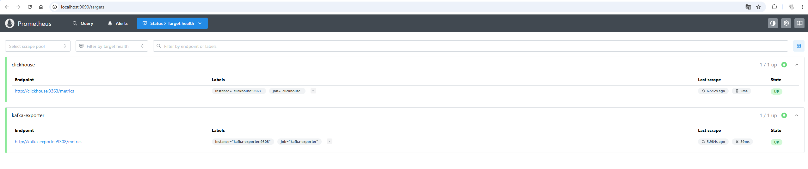
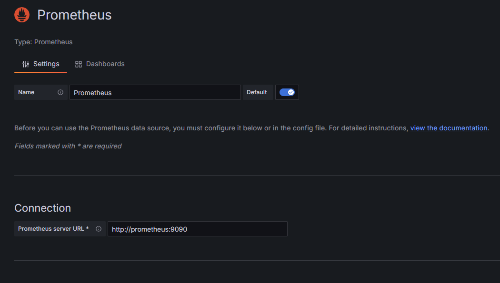
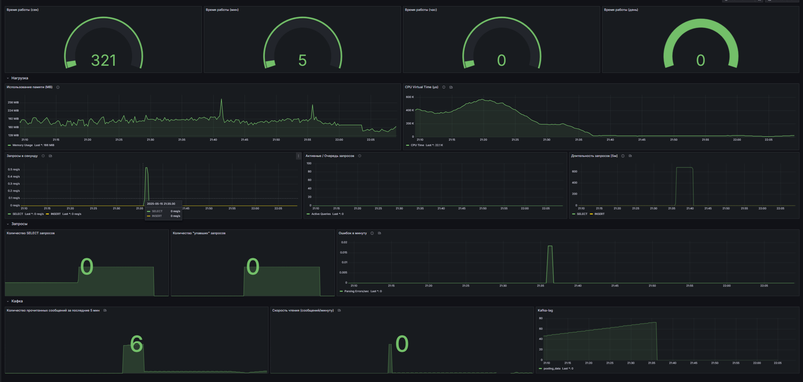
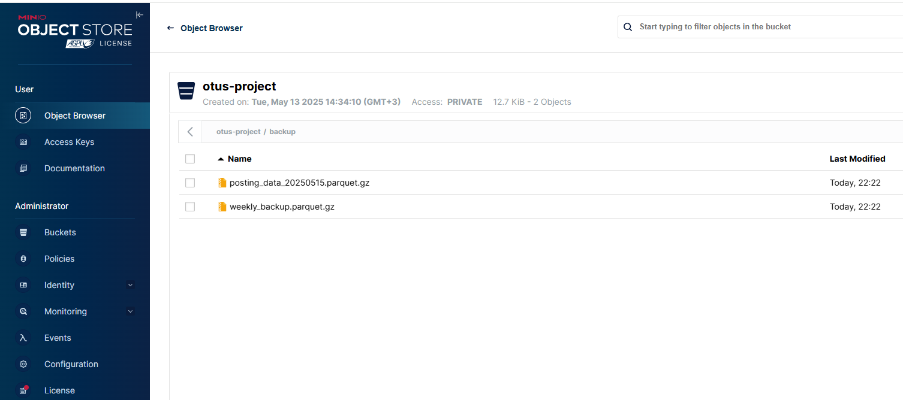

# otus_project

Работа полностью выполнена на локальной машине в докере

## Порядок выполнения работы
### Подготовка инфраструктурвы
1. Подготовка [docker-compose.yml](otus_project/docker-compose.yml) под сервисы `Clcikhouse`, `Airflow`, `S3`, `Prometheus`, `kafka-exporter`.
2. Отладка [docker-compose.yml](otus_project/docker-compose.yml) до состояния "запуск по кнопке".
3. Настройка необходимого взаимодействия `Clcikhouse` с `Prometheus`.

> **Примечание:**
Все необходимые конфиги для запуска и интеграции с `Prometheus` и настройки user добавяются в контейнер при его запуске через папки [clickhouse_config](otus_project/clickhouse_config) и [clickhouse_users](otus_project/clickhouse_users). Xml можно в них

4. Объединение [docker-compose.yml](otus_project/docker-compose.yml) с частью подгготовленной коллегой `Омелаевой Алиной`
5. Отладка общего [docker-compose.yml](otus_project/docker-compose.yml) до состояния "запуск по кнопке" (согласование версий проектов, дополнения .env и т.п.)

### Подготовка дашбордов мониторинга Clickhouse в Grafana. 
1. Запуск `kafka-exporter` для того, что бы контролировать лаг сообщений kafka.
2. Проверка таргетов в `Prometheus`. Оба должны быть в состоянии `up`

3. Создание в `Grafana` datasource `Prometheus` на хост http://prometheus:9090



4. Создание dashboards `Grafana` по необходимым метрикам. 

> **Примечание:** 
Панель из скриншота выше можно найти в [clickhouse-monitoring.json](otus_project/grafana/provisioning/dashboards/clickhouse-monitoring.json) в формате JSON

5. Подготовка `DAG` ([backup_s3_posting_data.py](otus_project/dags/backup_s3_posting_data.py)) по сохранению backup.
> **Примечание:** DAG осуществляет backup данных таблицы по предыдущему дню:
```sql
INSERT INTO FUNCTION s3(
        'http://minio:9000/otus-project/{file_name}',
        '{s3_access_key}',
        '{s3_secret_key}',
        'Parquet'
    )
    SELECT * FROM otus.posting_data
    WHERE clickhoue_timestamp >= '{start_time}'
```
>По неделе
```sql
INSERT INTO FUNCTION s3(
        'http://minio:9000/otus-project/backup/weekly_backup.parquet.gz',
        '{s3_access_key}',
        '{s3_secret_key}',
        'Parquet'
    )
    SELECT * FROM otus.posting_data
    WHERE clickhoue_timestamp >= today() - 7
```
>Очишает данные старше 7 дней

Коннект в Airflow осуществляется через библиотеку `clickhouse-connect`
>**Примечание** ставится на Airflow при запуске контейнера. Все устанавливаемые библиотеки хранятся в  [requirements.txt](otus_project/requirements.txt). Креды для S3 и Clcikhouse лежат в connections Airflow, достаются через BaseHook

```python
conn_id = kwargs.get('conn_id')
    s3_con = kwargs.get('s3_con')

    connection_clickhouse = BaseHook.get_connection(conn_id)
    connection_s3_con = BaseHook.get_connection(s3_con)

    conn_data = {
        'host': connection_clickhouse.host,
        'port': connection_clickhouse.port,
        'user': connection_clickhouse.login,
        'password': connection_clickhouse.password,
        'database': connection_clickhouse.schema,
    }

    s3_con_data = {
        "s3_access_key": connection_s3_con.login,
        "s3_secret_key": connection_s3_con.password,
        "file_name": file_name,
        "start_time": start_time,
    }
```
Backup производится один раз в сутки и данные кладутся на S3:
